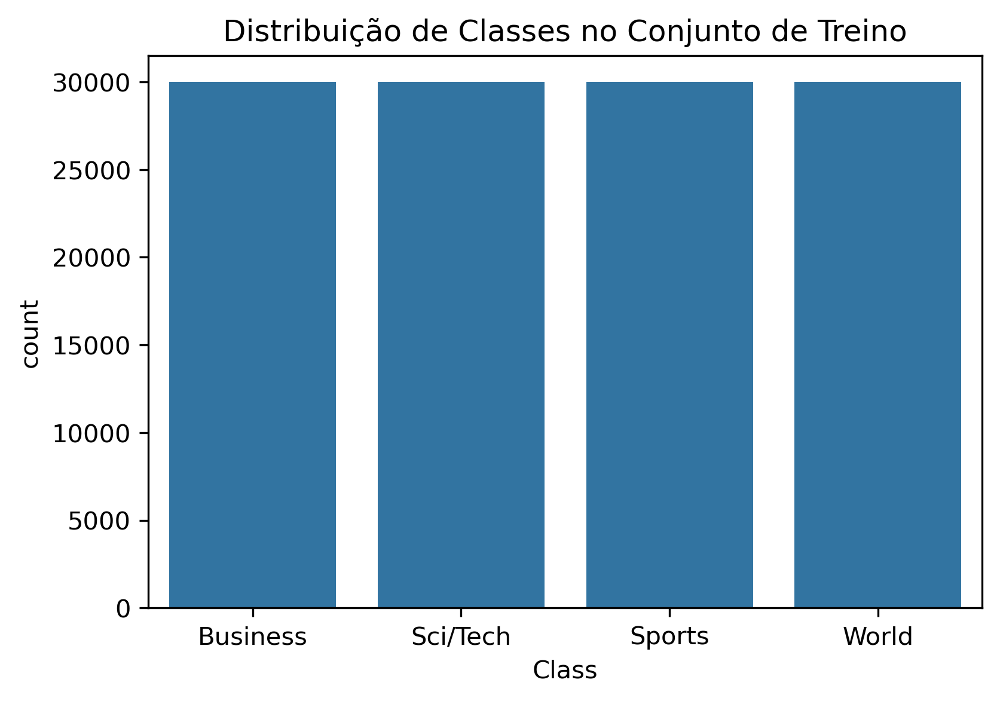
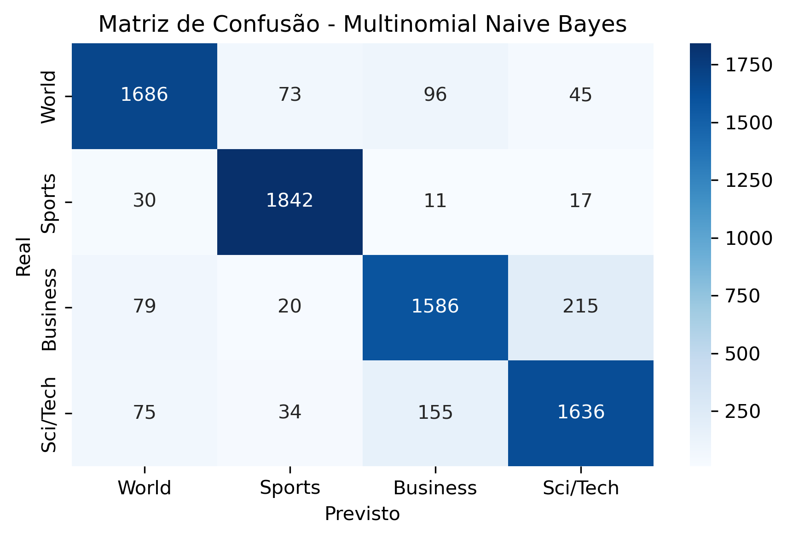

# NewsClassifier: Classificação de Notícias com Processamento de Linguagem Natural

#### 🎯 Objetivo

Classificar automaticamente notícias em diferentes categorias (esportes, negócios, política, tecnologia, etc.) usando técnicas de Processamento de Linguagem Natural (NLP) e algoritmos de machine learning.

---

### ⚙️Criando env

```
conda create --name cases_data_science python=3.10
conda activate cases_data_science
```

Se precisar deletar env

```
conda remove --name cases_data_science --all
```

Exportar notebook para md

```
jupyter nbconvert 01_eda_preprocessing_modeling.ipynb --to markdown --no-input

```

Criando env com environment.yml

```
conda env create -f environment.yml
conda activate nome_env
```

---

#### 📊 Fonte dos Dados

- Dataset: [AG News Corpus](https://www.kaggle.com/datasets/amananandrai/ag-news-classification-dataset) ou via `torchtext.datasets.AG_NEWS`
- 4 categorias: World, Sports, Business, Sci/Tech
- ~120.000 exemplos rotulados

---

### 🗂️ Estrutura de Pastas e Arquivos

```
nlp-text-classification-news/
│
├── data/                # Dados brutos e tratados
│   ├── raw/
│   └── processed/
│
├── notebooks/           # Notebooks principais
│   ├── 01_eda_preprocessing_modeling.ipynb
│
├── models/              # Modelos treinados (opcional)
│
├── reports/
│
├── requirements.txt
├── README.md
└── utils.py             # Funções auxiliares

```

---

#### ⚙️ Processos Incluídos

- Exploração dos dados textuais (wordclouds, frequência de palavras)
- Pré-processamento com NLTK ou spaCy
- Vetorização com TF-IDF
- Modelagem com:
  - Regressão Logística (baseline)
  - Random Forest
  - XGBoost
- Avaliação: accuracy, F1-score, matriz de confusão
- Visualizações com seaborn e matplotlib

---

### ⚙️ Como Executar Localmente

1. Clone o repositório:

```
git clone https://github.com/seuusuario/nlp-text-classification-news.git
cd nlp-text-classification-news
```

2. Crie um ambiente virtual (opcional) e instale as dependências:

```
pip install -r requirements.txt
```

3. Inicie os notebooks:
   ```
   jupyter notebook
   ```

Abra os notebooks na pasta `notebooks/` e execute em ordem.

### 📊 Salvar gráficos

Plotly precisa da biblioteca **kaleido** para exportar gráficos como imagem:

```
pip install -U kaleido
```

---

## 📊 Resultados da Modelagem

Foram avaliados diferentes algoritmos de classificação para categorizar notícias da base AG News, utilizando vetorização TF-IDF e métricas de desempenho como Acurácia, Precisão, Revocação e F1-Score. Os modelos testados foram:

- **Logistic Regression**
- **Multinomial Naive Bayes**
- **Random Forest**
- **Linear SVM**

### 📌 Distribuição das Classes no Treinamento

A distribuição das categorias no conjunto de treino é relativamente equilibrada:



### 🎯 Métricas por Modelo

#### 🔹 Logistic Regression

**Acurácia** : 0.9041


---

#### 🔹 Multinomial Naive Bayes

**Acurácia** : 0.8882



---

#### 🔹 Random Forest

**Acurácia** : 0.8667


---

#### 🔹 Linear SVM

**Acurácia** : 0.9033


---

### 🏁 Comparação Geral

| Modelo                  | Acurácia | Precision | Recall | F1-Score |
| ----------------------- | -------- | --------- | ------ | -------- |
| Logistic Regression     | 0.9041   | 0.9039    | 0.9041 | 0.9039   |
| Linear SVM              | 0.9033   | 0.9031    | 0.9033 | 0.9031   |
| Multinomial Naive Bayes | 0.8882   | 0.8876    | 0.8882 | 0.8878   |
| Random Forest           | 0.8667   | 0.8667    | 0.8667 | 0.8662   |

---

### ✅ Conclusão

- **Logistic Regression** e **Linear SVM** apresentaram os melhores desempenhos.
- O modelo **Random Forest** teve desempenho inferior, especialmente em categorias com menor volume textual.
- Os resultados indicam que modelos lineares são mais eficazes neste contexto, devido à natureza textual vetorizada com TF-IDF.

---

### Licença

Este projeto está sob a licença MIT - veja o arquivo [LICENSE](./LICENSE) para detalhes.

---

### Contato

LinkedIn: [linkedin.com/in/heitorandradeoliveira](https://linkedin.com/in/heitorandradeoliveira)

---
